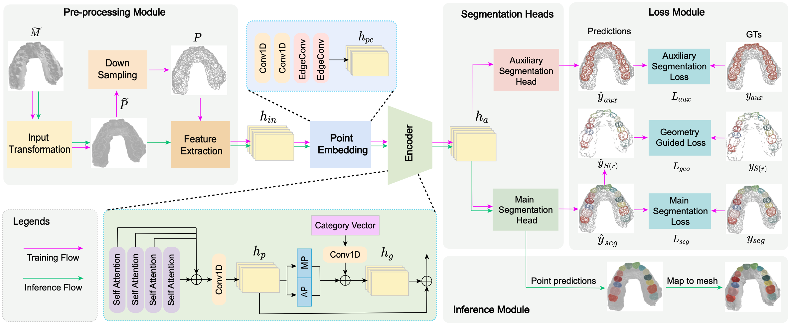

# TSegFormer: 3D Tooth Segmentation in Intraoral Scans with Geometry Guided Transformer

This is the PyTorch implementation of TSegFormer [MICCAI 2023] [[Paper link](https://link.springer.com/chapter/10.1007/978-3-031-43987-2_41)]. 

TSegFormer is a novel 3D tooth segmentation framework with a tailed 3D transformer and a multi-task learning paradigm, 
aiming at distinguishing the permanent teeth with divergent anatomical structures and noisy boundaries. Moreover, we 
design a geometry-guided loss based on a novel point curvature to refine boundaries in an end-to-end manner, avoiding 
time-consuming post-processing to reach clinically applicable segmentation.



## Usage

### Requirements

* python==3.7.11
* torch==1.9.0+cu111
* scikit-learn
* tqdm

### Training nad testing 
Put the IOS dataset in the `./data` folder.  

Run the training script for pretraining:

`python main.py --epochs 200 --num_points 10000`

The pre-trained model `best_model.t7` is saved in `./outputs/exp/models`.  

Run the evaluation script with the pretrained model `best_model.t7` for testing:

`python main.py --eval True --model_path ./outputs/exp/models/best_model.t7`

## Citation

If you find our work useful in your research, please consider citing:

```bibtex
@article{xiong2023tsegformer,
      title={TSegFormer: 3D Tooth Segmentation in Intraoral Scans with Geometry Guided Transformer}, 
      author={Huimin Xiong and Kunle Li and Kaiyuan Tan and Yang Feng and Joey Tianyi Zhou and Jin Hao and Haochao Ying and Jian Wu and Zuozhu Liu},
      year={2023},
      eprint={2311.13234},
      archivePrefix={arXiv},
      primaryClass={cs.CV}
}


```